<div class="markdown-body">

# CS3205: Introduction to Computer Networks

Taken it in the Jan-May 2026 under Prof. Mukulika Maity.

Work of **Karthik Kashyap K (EE23B030)**.

# Assignment 1

The Report for the Assignment can be 
<a href="../static/report/assignment1.pdf" target="_blank" rel="noopener">
  viewed here
</a>.


Here are the images and codes so that they can be inspected clearly rather than viewed from a pdf.

## 1. Traceroute and Ping

### 1a

<div class="image-row">

  <a href="../static/img/assignment1/1a_tcptraceroute_iitb.png">
    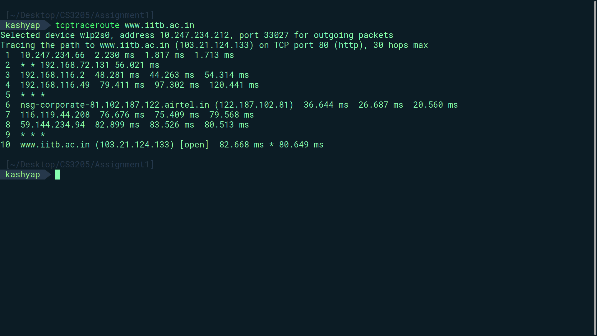
  </a>

  <a href="../static/img/assignment1/1a_tcptraceroute_aust.png">
    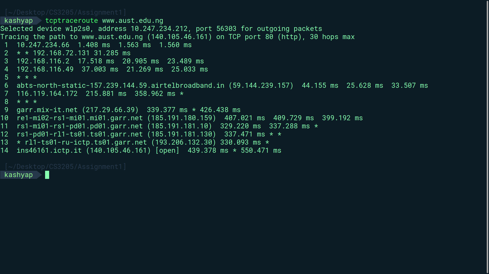
  </a>

</div>

### 1c

<div class="image-row">

  <a href="../static/img/assignment1/1c_tcpping_iitb_1.png">
    
  </a>

  <a href="../static/img/assignment1/1c_tcpping_iitb_2.png">
    
  </a>

</div>

### 1d

<div class="image-row">

  <a href="../static/img/assignment1/1d_tcpping_aust_1.png">
    
  </a>

  <a href="../static/img/assignment1/1d_tcpping_aust_2.png">
    
  </a>

</div>

## 2. DNS Server

### 2a

<div class="image">

  <a href="../static/img/assignment1/2a_IITB.png">
    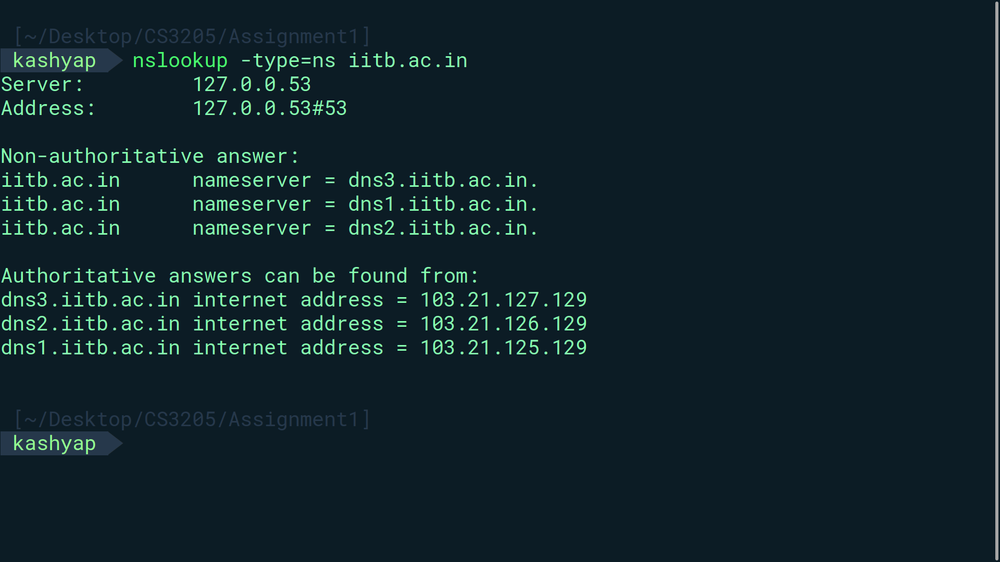
  </a>

</div>

<div class="image-row">

  <a href="../static/img/assignment1/2a_AUST1.png">
    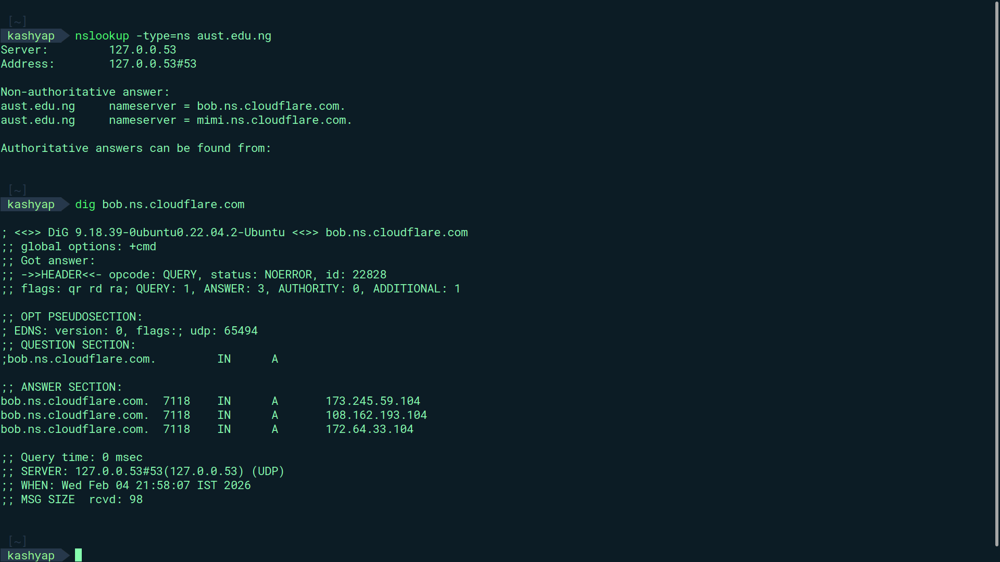
  </a>

  <a href="../static/img/assignment1/2a_AUST2.png">
    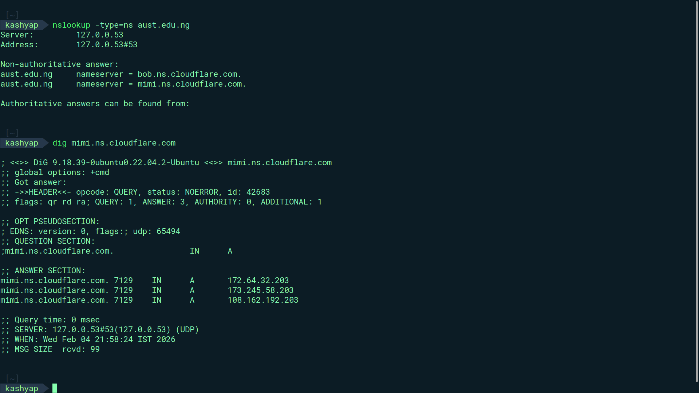
  </a>

</div>

### 2b

<div class="image-row">

  <a href="../static/img/assignment1/2b_IITB.png">
    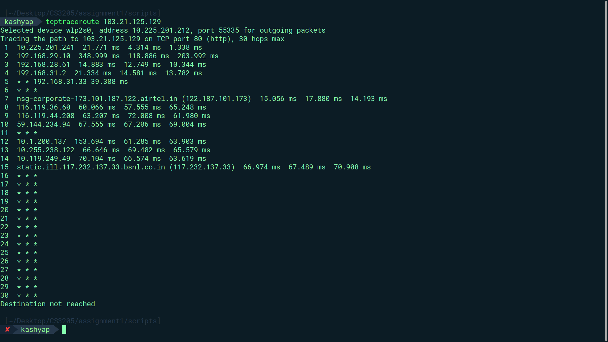
  </a>

  <a href="../static/img/assignment1/2b_AUST.png">
    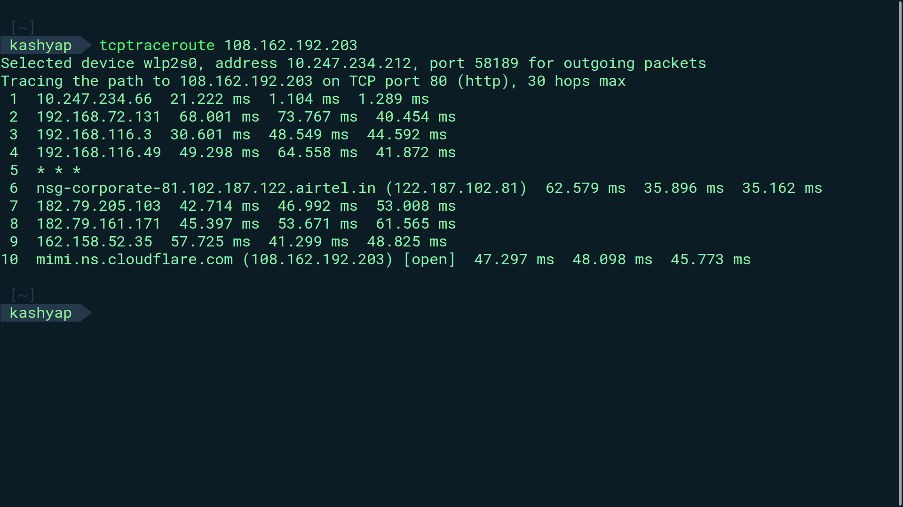
  </a>

</div>

## 3. Packet Loss

<div class="image">

  <a href="../static/img/assignment1/3_packetloss.png">
    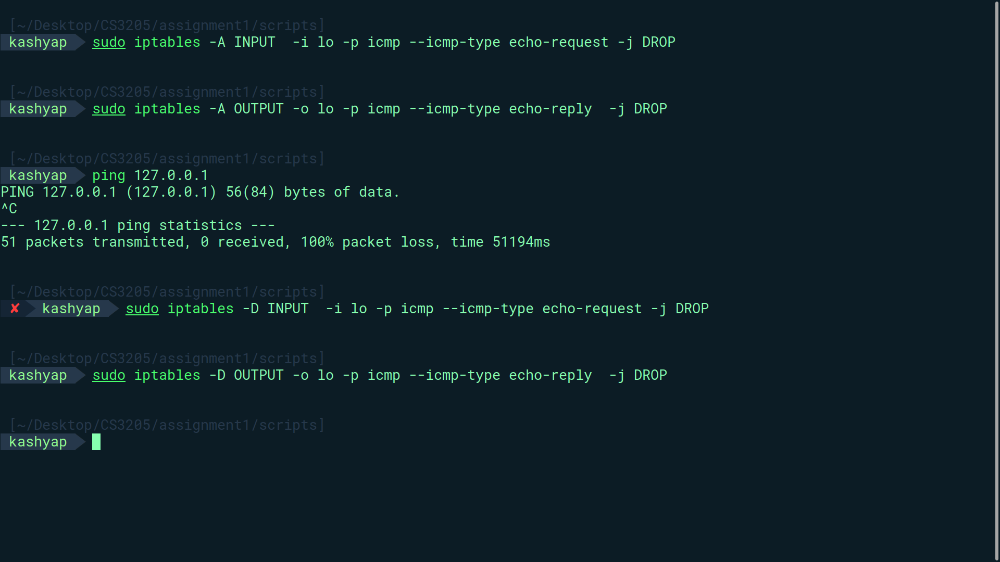
  </a>

</div>

## 4. Packet Trace

### 4a

```python
{{CODE:4_a.py}}
```

<div class="image">

  <a href="../static/img/assignment1/4a.png">
    
  </a>

</div>

### 4b

```python
{{CODE:4_b.py}}
```

<div class="image">

  <a href="../static/img/assignment1/4b.png">
    
  </a>

</div>

### 4c

```python
{{CODE:4_c.py}}
```

<div class="image">

  <a href="../static/img/assignment1/4c.png">
    
  </a>

</div>

### 4d

```python
{{CODE:4_d.py}}
```

<div class="image">

  <a href="../static/img/assignment1/4d_plot_download_times.png">
    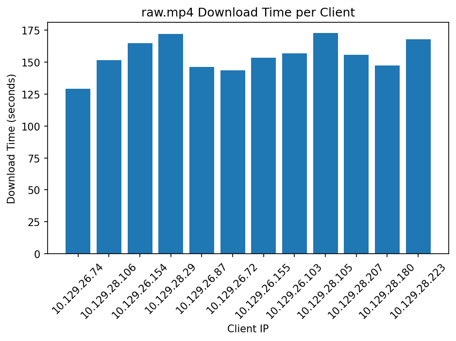
  </a>

</div>

### 4e

```python
{{CODE:4_e.py}}
```

<div class="image">

  <a href="../static/img/assignment1/4e.png">
    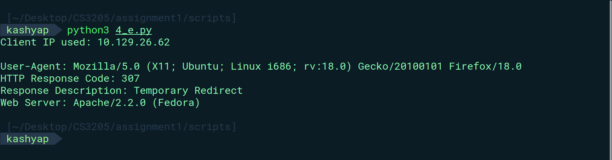
  </a>

</div>

### 4f

```python
{{CODE:4_f.py}}
```

<div class="image-row">

  <a href="../static/img/assignment1/4f_1.png">
    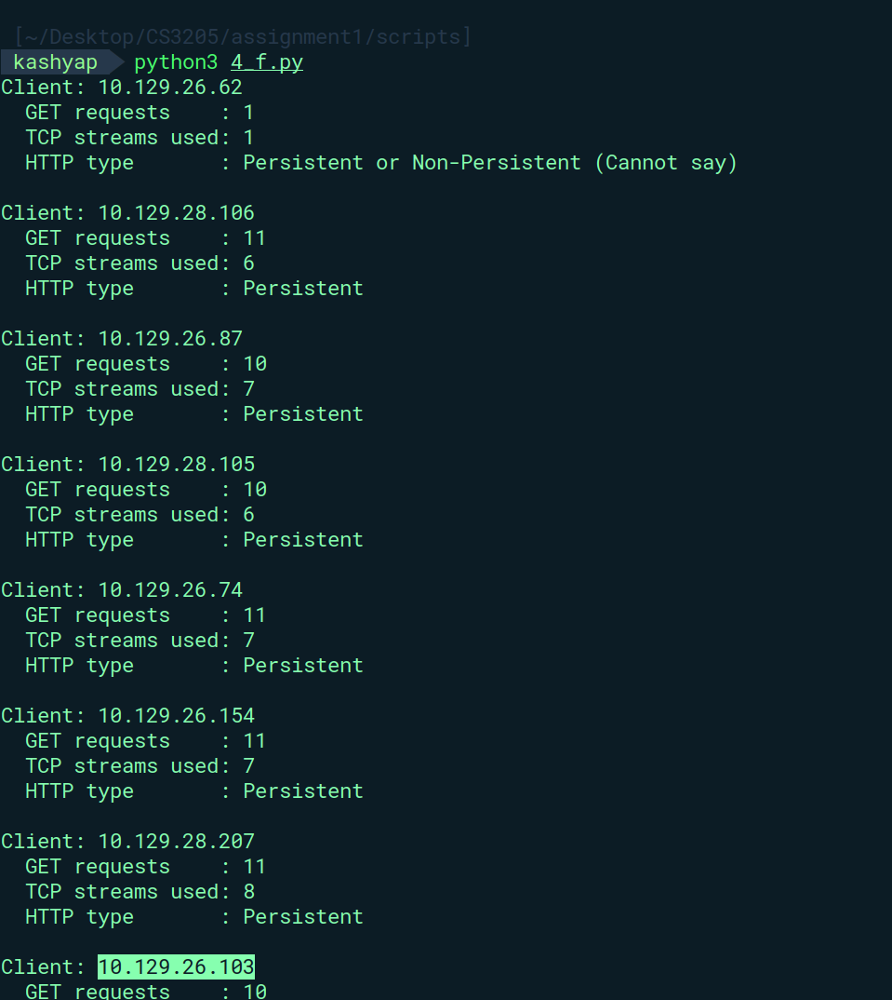
  </a>

  <a href="../static/img/assignment1/4f_2.png">
    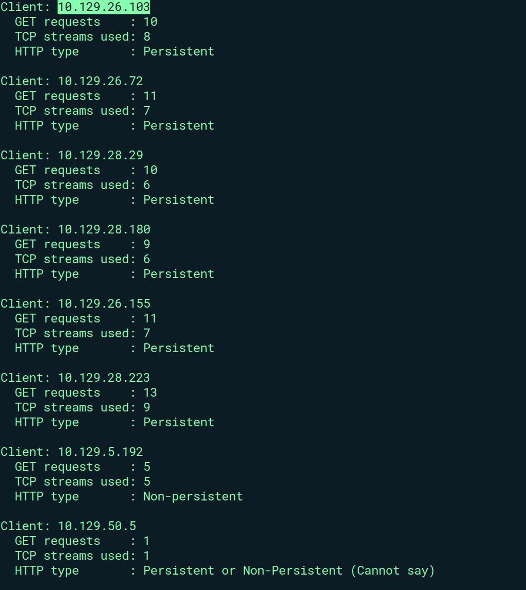
  </a>

</div>

### 4g

```python
{{CODE:4_g.py}}
```

<div class="image">

  <a href="../static/img/assignment1/4g.png">
    
  </a>

</div>

## 5. Wireshark

### 5a

```python
{{CODE:5_a.py}}
```

<div class="image-row">

  <a href="../static/img/assignment1/5a.png">
    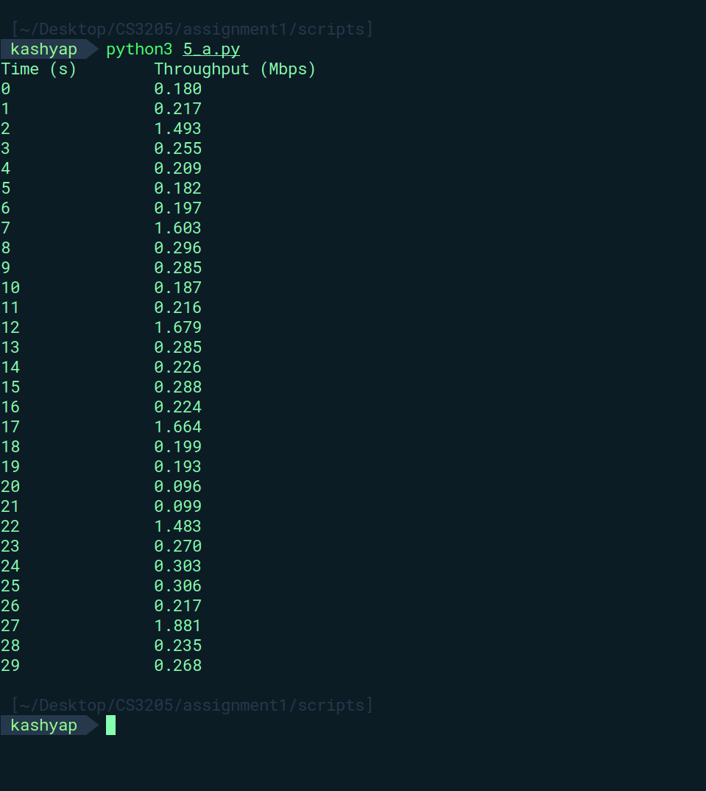
  </a>

  <a href="../static/img/assignment1/5a_plot_throughput.png">
    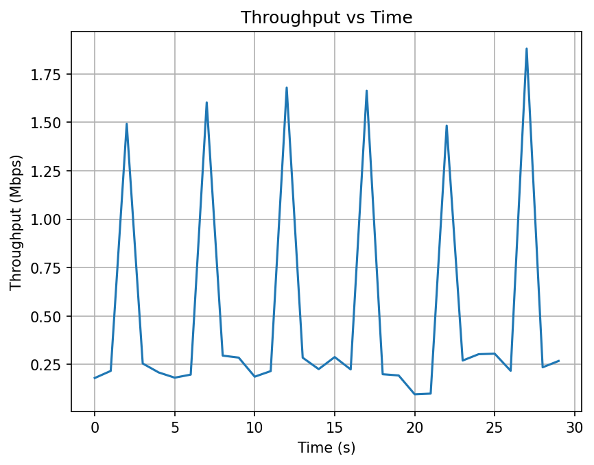
  </a>

</div>

### 5b

<div class="image-row">

  <a href="../static/img/assignment1/5b_1.png">
    
  </a>

  <a href="../static/img/assignment1/5b_2.png">
    
  </a>

</div>

<div class="image-row">

  <a href="../static/img/assignment1/5b_3.png">
    
  </a>

  <a href="../static/img/assignment1/5b_4.png">
    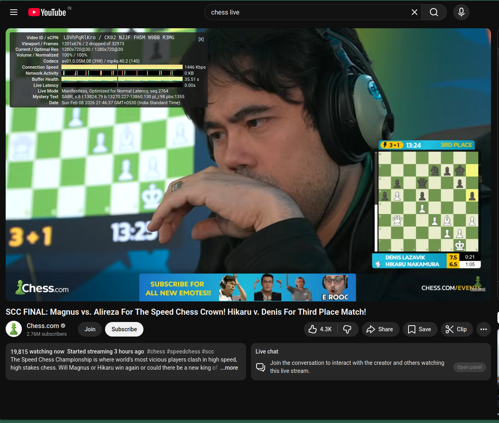
  </a>

</div>

### 5c

<div class="image">

  <a href="../static/img/assignment1/5c.png">
    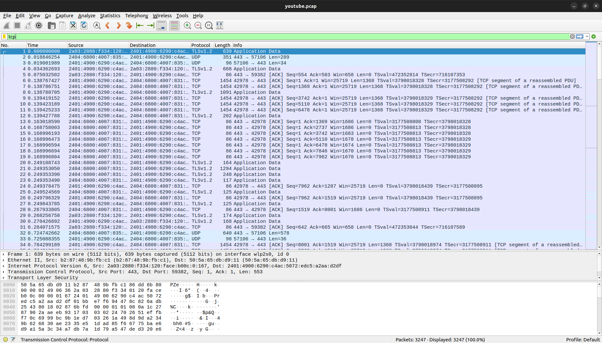
  </a>

</div>

</div>