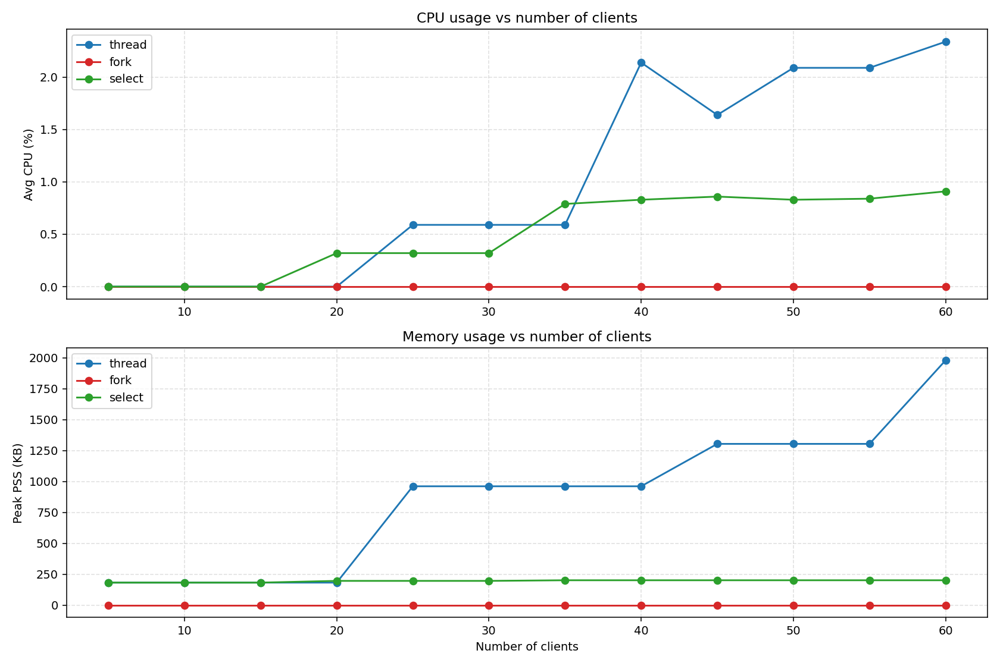
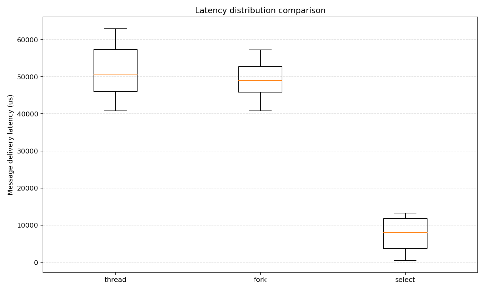
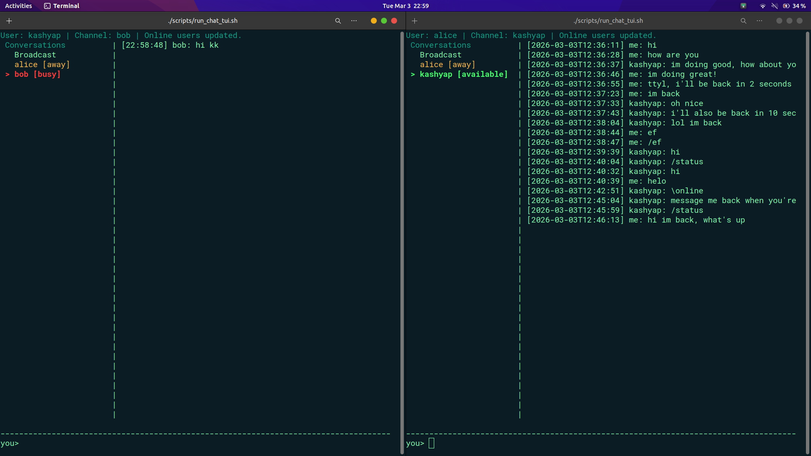

<div class="markdown-body">

# CS3205: Introduction to Computer Networks

Taken it in the Jan-May 2026 under Prof. Mukulika Maity.

Work of **Karthik Kashyap K (EE23B030)**.

# Assignment 2

The Perfornmance Report for the Assignment can be 
<a href="../static/report/assignment2.pdf" target="_blank" rel="noopener">
  viewed here
</a>.


Here are the images and codes so that they can be inspected clearly rather than viewed from a pdf.

### Chat Client

```c
{{CODE:chat_client.c}}
```

### Discovery Server

```c
{{CODE:discovery_server.c}}
```


### Chat Server: Fork

```c
{{CODE:chat_server_fork.c}}
```


### Chat Server: Select

```c
{{CODE:chat_server_select.c}}
```


### Chat Server: Thread

```c
{{CODE:chat_server_thread.c}}
```


### Load Testing Script

```bash
{{CODE:load_test.sh}}
```

### Stress Testing Script

```bash
{{CODE:stress_test.sh}}
```

### Plotting graphs

```python
{{CODE:plot_benchmarks.py}}
```

Instead of running the code, this script can be run:

```bash
{{CODE:plot_latest.sh}}
```

Here are the plots:

<div class="image-row">

  <a href="../static/img/assignment2/cpu_memory_vs_clients.png">
    
  </a>

  <a href="../static/img/assignment2/latency_distribution_comparison.png">
    
  </a>

</div>

### Vibe coded Chat TUI

A vibe coded Chat UI was made to send and receive messages, including a login window. This can be run (provided the chat server and discovery server are running in background terminals) by the script command as: 

```bash
./run_chat_tui.sh
```

This is an example look as to how the interface is seen:

<div class="image">

  <a href="../static/img/assignment2/chat_tui.png">
    
  </a>

</div>


### Other information

- Lots of inspiration was taken from the socket programming library provided by the TAs.
- This assignment required coding in `c` lanuage using libraries that I was not aware about or have knowledge about. Hence I had to use some use of LLMs to write the code, also because it was a very lengthy assignment.

</div>