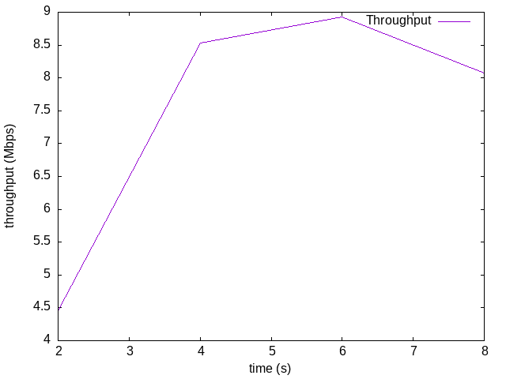
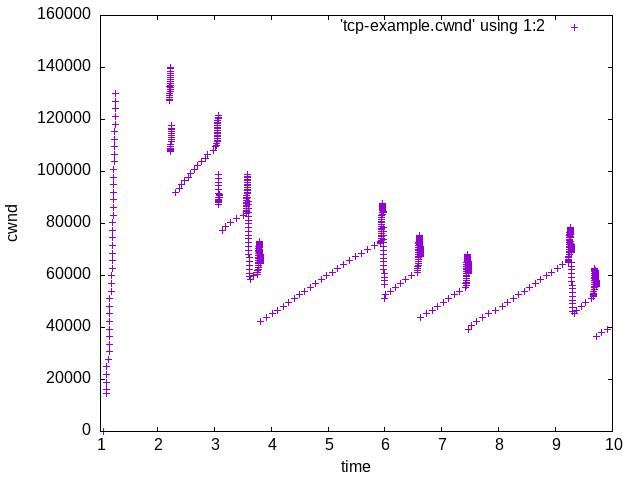
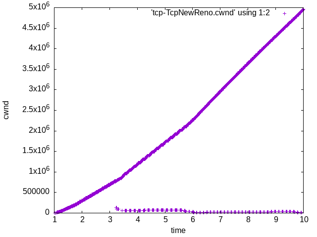
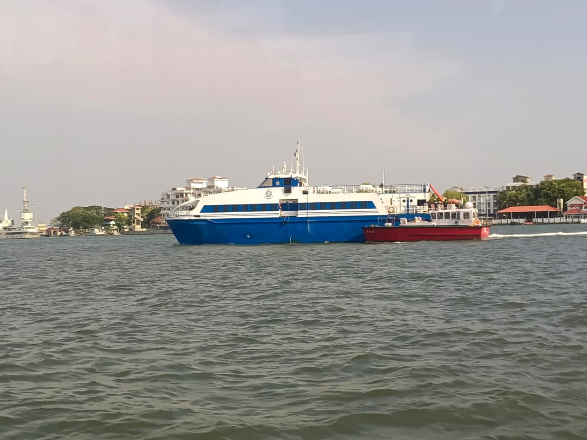
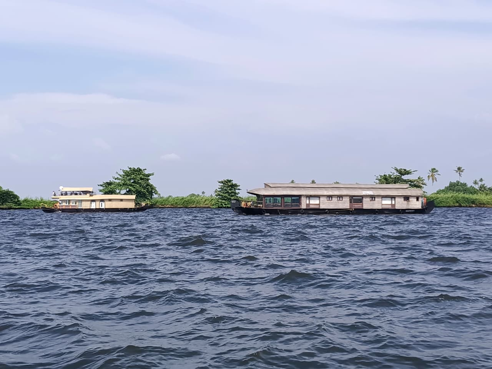
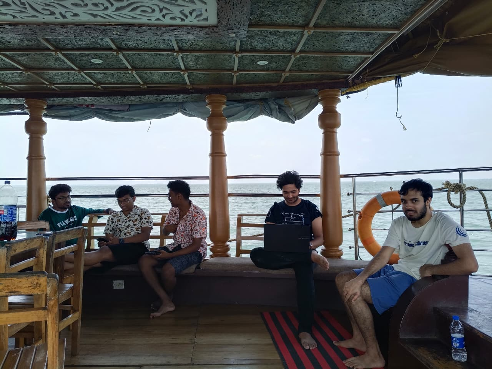

<div class="markdown-body">

# CS3205: Introduction to Computer Networks

Taken it in the Jan-May 2026 under Prof. Mukulika Maity.

Work of **Karthik Kashyap K (EE23B030)**.

# Assignment 3

<!-- This website is currently under development, and will be updated soon (Monday night by the latest) due to me being on a Trip in Kochi (Kerala). -->

The Report for the Assignment can be 
<a href="../static/report/assignment3.pdf" target="_blank" rel="noopener">
  viewed here
</a>.


Here are the images and codes so that they can be inspected clearly rather than viewed from a pdf.

## Q1. One TCP flow

Simulation code:

```c
{{CODE:Q1_tcp-example-cwnd.cc}}
```

### 1(c) Plot Throughput

<div class="image">

  <a href="../static/img/assignment3/1c.png">
    
  </a>

</div>

### 1(e) Plot CWND

<div class="image">

  <a href="../static/img/assignment3/1e.png">
    
  </a>

</div>

## Q2. Two Competing TCP flows

Simulation code:

```c
{{CODE:Q2_tcp-example-cwnd.cc}}
```


## Q3. Multiple Parallel Connections

Simulation code:

```c
{{CODE:Q3_tcp-example-cwnd.cc}}
```

## Q4. TCP Variant Comparison

Simulation code:

```c
{{CODE:Q4_tcp-example-cwnd.cc}}
```

### 4(a) CWND Comparison

CWND plots of TCPCubic and TCPNewReno:

<div class="image-row">

  <a href="../static/img/assignment3/1e.png">
    
  </a>

  <a href="../static/img/assignment3/4a.png">
    
  </a>

</div>

## Apology

If this assignment seems a bit rushed, then my apologies, but I was doing this assignment when I was on a trip with my friends to Kochi (Kerala). Here are a few pictures as a proof. 

Pictures show the **Water Metro** at Kochi, Me in a **Kayaking**, **House Boats** at Alappuzha, and finally an image of **me doing the assignment** in the house boat :(

<div class="image-row">

  <a href="../static/img/assignment3/water_metro.jpeg">
    
  </a>

  <a href="../static/img/assignment3/kayaking.jpeg">
    
  </a>

</div>

<div class="image-row">

  <a href="../static/img/assignment3/house_boat.jpeg">
    
  </a>

  <a href="../static/img/assignment3/me_doing.jpeg">
    
  </a>

</div>

The website for the assignment was updated after I came back to insti since I had no time during the trip to update it. I struggled to get the assignment completed there as is.

</div>